# Contents  

[ABOUT PROJECT](#about-project)
  - [프로젝트 구성원](#1-프로젝트-구성원)
  - [프로젝트 열기](#2-프로젝트-열기)
  - [주제 선정 이유](#3-주제-선정-이유)
  - [요구사항 분석](#4-요구사항-분석)
  - [시스템 설계](#4-시스템-설계)
  - [사용 기술](#6-사용-기술)

[Results](#results)
  - [결과물](#1-결과물)
    - [Main Page](#main-page)
    - [Administrator Page](#administrator-page)
    - [Log-in / Log-out](#log-in--log-out)
    - [Sign-up](#sign-up)
    - [Search](#search)
    - [Booking](#booking)
    - [Owner Service](#owner-service)
    - [My Page](#my-page)
    - [Managing](#managing)
  - [아쉬움](#2-아쉬움)

# ABOUT PROJECT
#### [ WeCamp ] 캠핑장 검색, 예약 및 관리 서비스 제공 웹 개발 프로젝트  *( 2020.07.27 ~ 2020.09.18 )*

## 1. 프로젝트 구성원

|*Members*|*Contact*|
|:---:|---|
|**이민서**| |
|**정혜원**| |
|**이수빈**| |
|**한다솜**| |

## 2. 프로젝트 열기
1. Github Code 복사
2. Apache Tomcat 연결 ( v9.0 )
3. Spring 프로젝트 Import
4. Oracle DB 연결
   1. src/main/webapp/WEB-INF/views/sql
      1. SQL문 실행 (WeCamp_createTables.sql, WeCamp_createSequences.sql)
5. 설정 변경
   1. root-context.xml
      1. jdbcUrl
      2. username
      3. password
   2. package : com.wecamp.setting.Path
      1. 업로드 파일 경로 설정
6. Tomcat Server 실행
   
## 3. 주제 선정 이유
&nbsp;현재 **코로나19**로 인해 많은 변화가 일어났다. 그 중 사람들이 여가나 휴가를 보내는 방식이 크게 바뀌었는데, 예전에는 해외 여행을 갔던 사람들이 많았던 반면 지금은 캠핑을 통해 여가를 즐기는 사람들이 **증가**하고 있다.  
> *"코로나바이러스감염증-19 확산에 여행인구가 급격히 추락했음에도 캠핑은 다소 선전하고 있는 것으로 나타났다 ..."* [ 코로나19로 추락한 여행인구…캠핑은 예외? 3월수요 증가세 - 아주경제 | 2020-04-10 ]

&nbsp;이러한 사회적 변화에 큰 관심을 갖기 시작했고 **캠핑장**을 아주 쉽고 간단하게 **검색**해보고 **예약**할 수 있는 웹 사이트를 구현해보고 싶어서 주제를 선정하게 되었다.

## 4. 요구사항 분석

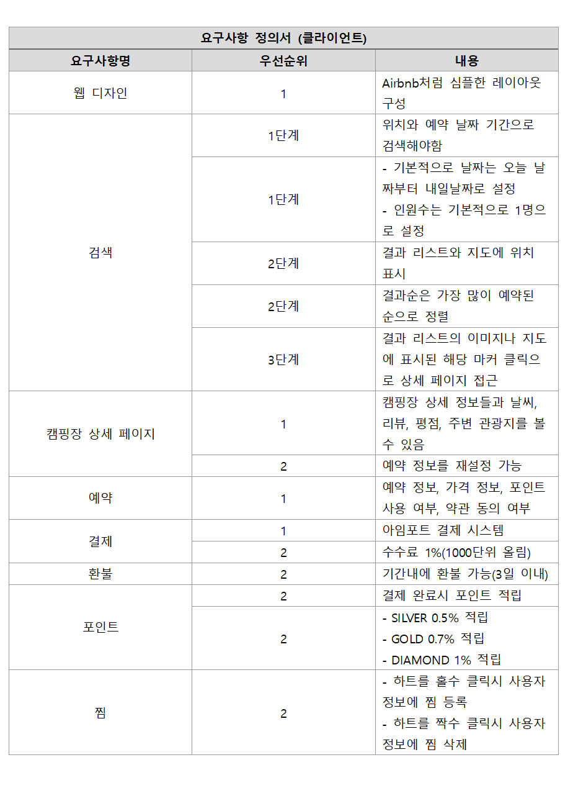
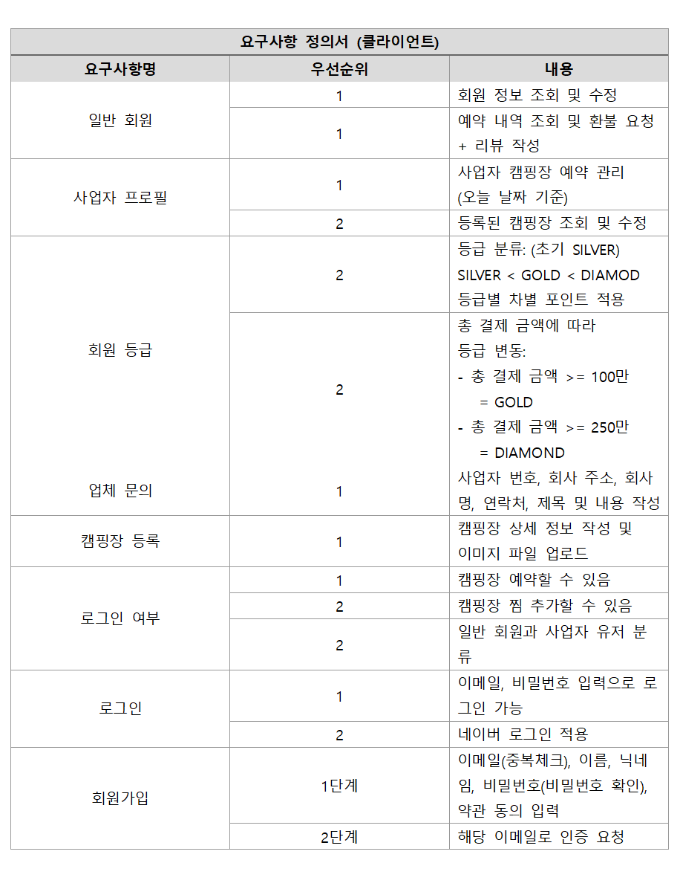
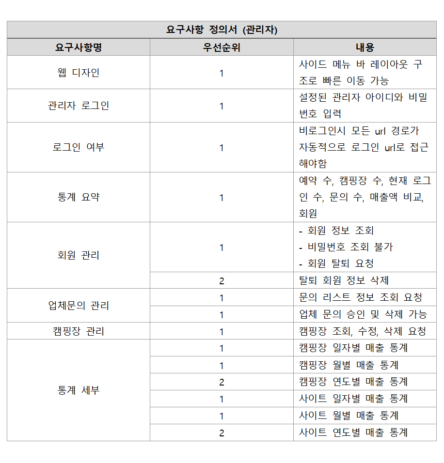

## 5. 시스템 설계
### *MVC Design Pattern*

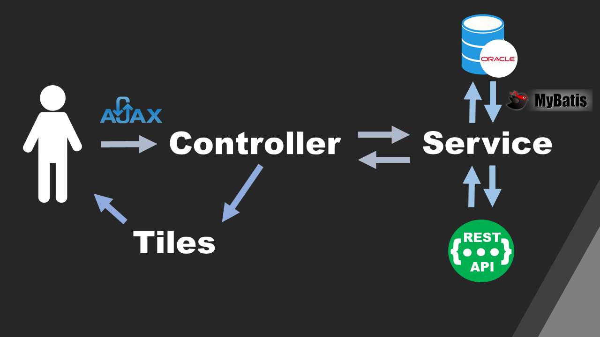
 
&nbsp;시스템 설계는 기본적으로 Spring Framework를 통해 **MVC**를 기반으로 설계했다. 확실히 이번에 Spring MVC를 사용하면서 전보다 유지보수하기가 굉장히 편안함을 느꼈다.😌  
&nbsp;**Model**은 Model과 VO로 나누었다. 그 이유는 DTO( *Data Transfer Object* )와 VO( *Value Object* )의 속성을 확실히 나누어 관리하기 위해서 나누었다. **Controller**는 그 기능을 확실히 하기 위해서 데이터만 왔다갔다 할 수 있도록 코드를 간단하게 정의하려 노력했다. 그래서 대부분의 로직, 비지니스 로직을 **Service**에서 관리했다. **DAO**( *Data Access Object* )는 **MyBatis**를 사용하면서 더 깔끔하게 쿼리문들을 관리, 작성 할 수 있었다. 그리고 클라이언트에게 시각적이고 직접적으로 근접해있는 **View**로 구성하였다. View의 전체적인 Layout을 관리하기 위해서 **Apache Tiles**를 사용하였다. 사실 타일즈를 사용하기로 마음먹은 계기가 있었는데 페이지 마다 Title을 설정하기 위함과 관리자 페이지도 구현하게 되면서 다른 Layout을 확실히 구별하여 관리하여야 했고 제일 큰 문제는 유지보수 하기가 굉장히 어려움을 느껴 타일즈를 사용했다. 

### *Package Design*

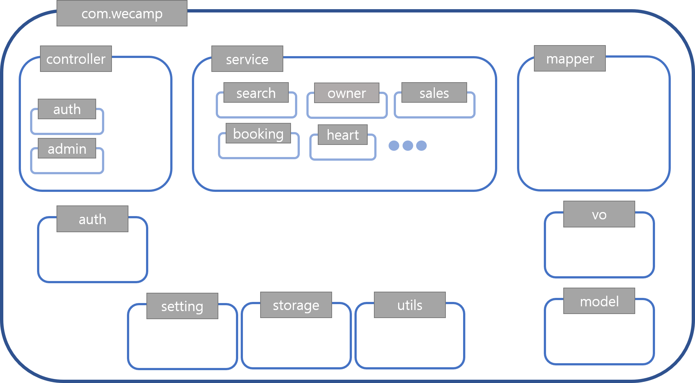

### *View Design*

- 메인 페이지
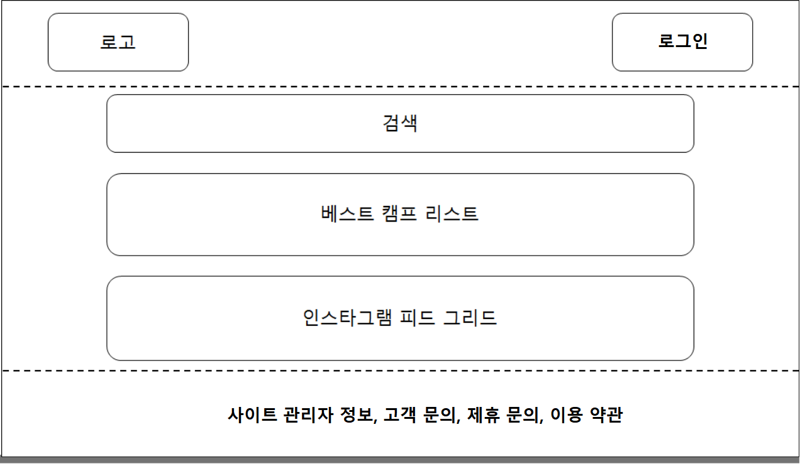
 

- 검색 결과 페이지
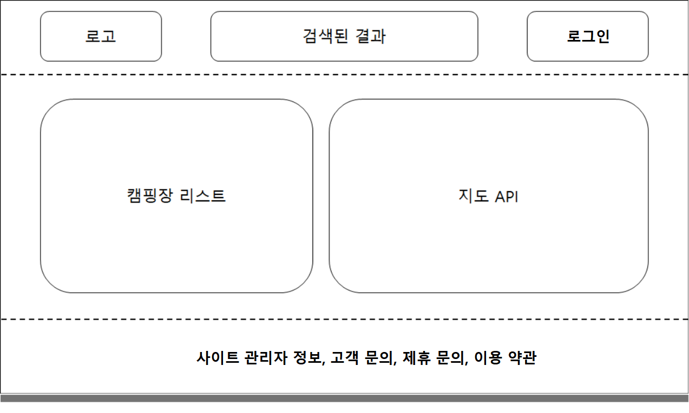
 

- 캠핑장 상세 페이지
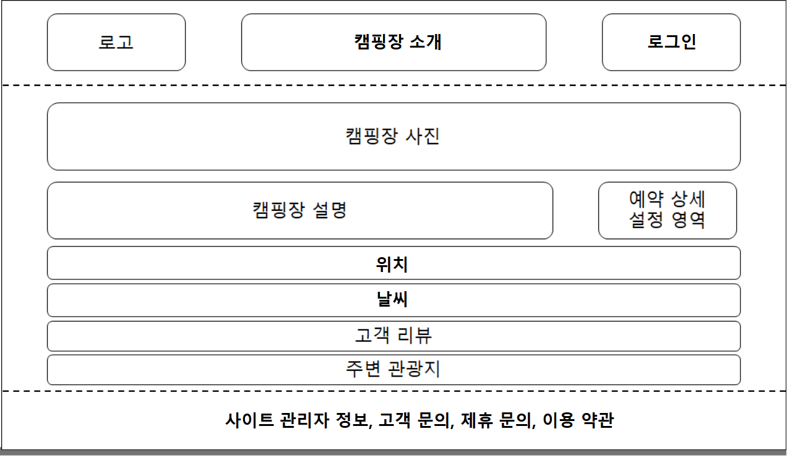
 

- 관리자 페이지
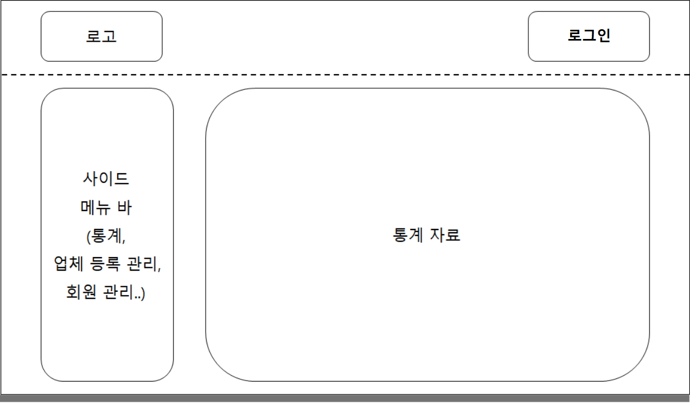
 

## 6. 사용 기술

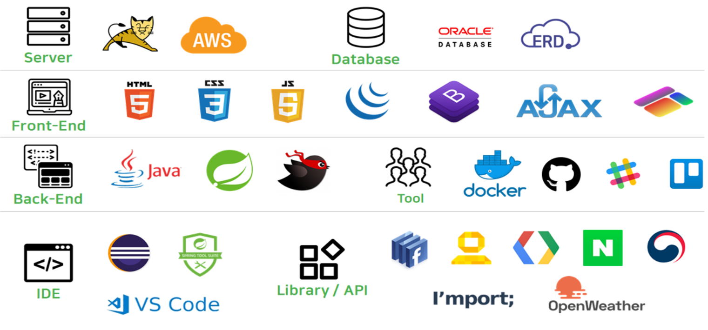

# Results
## 1. 결과물
### *Main Page*
  

 
&nbsp;메인 페이지에서 **검색기능**이 이 페이지에서 주 **서비스**이기 때문에 제일 상단에 배치하여 사용자가 가장 먼저 발견할 수 있도록 했다. 그 밑으로 현재 데이터 중 가장 많이 예약된 캠핑장 데이터를 배치하고 인스타 연동을 통해 최근 게시물을 볼 수 있게 하였다.

### *Administrator Page*

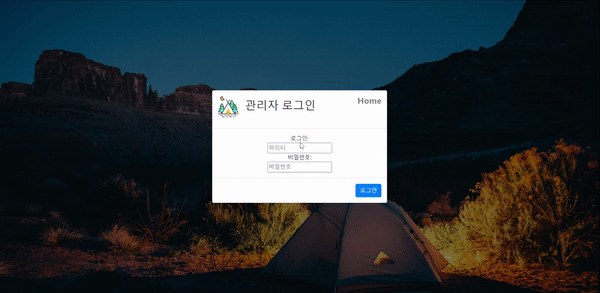
 
&nbsp;관리자 페이지는 해당 url을 직접 입력해야 접근할 수 있게 했다. 문제는 해당 url을 다른 외부 사용자가 직접 입력해서 접속하는 경우가 발생할 수 있는데 이러한 경우를 막기위해서 관리자로 로그인 되어있지 않아 관리자 Session이 설정되어 있지 않다면 Controller에서 어떠한 관리자 url 경로로 접속하여도 **무조건** 관리자 로그인 페이지로 접속하게끔 설계하였다.  
관리자 메인 페이지에는 간단한 정보들을 볼 수 있게 하였다. 또한 매 3초마다 **비동기 통신**으로 정보들이 **업데이트** 되기 때문에 굳이 페이지를 Reload 할 필요가 없다.

1. 예약 수 + 최근 예약 수
2. 캠핑장 수
3. 현재 로그인된 사용자 수
4. 문의 갯수 + 미완료 처리된 문의 갯수
5. 어제와 오늘의 매출액 비교 bar chart
6. 회원과 탈퇴회원 비교 pie chart
7. 로그인 회원 리스트

&nbsp;여기서 로그인 회원 리스트는 **HttpSessionBindingListener** 인터페이스를 활용해 로그인 Session이 생겼을 때와 사라졌을 때를 **Catch**해서 로그인유저 리스트에 담아 두었다.
 
( 활용 소스 코드 : [com.wecamp.model.Member.java](https://github.com/dlalstj0213/WeCamp_Project/blob/master/src/main/java/com/wecamp/model/Member.java), [com.wecamp.storage.LoginStorage.java](https://github.com/dlalstj0213/WeCamp_Project/blob/master/src/main/java/com/wecamp/storage/LoginStorage.java) )

---

### *Log-in / Log-out*

 - **기본 로그인**

 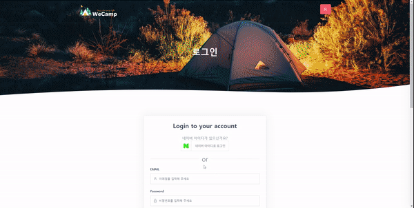
  
 &nbsp;기본적으로 로그인은 가입된 **이메일**로 로그인 할 수 있게 하였다. 로그인 후에 바로 재로그인 할 수 없으며, 로그아웃 후 재로그인 할 수 있다.

 - **네이버 로그인**

 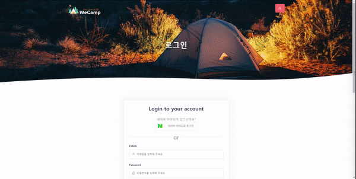
  
 &nbsp;네이버 오픈 API를 사용해 **네이버 아이디 로그인** 기능을 구현했다. 네이버 아이디로 로그인시, 프로필 정보를 조회해서 해당 아이디와 이메일 등 기본 정보를 DB에 저장하고 만약 똑같은 정보가 존재할시 같은 정보를 DB에 저장하지 않는다. 로그아웃은 기존 로그아웃과 동일하다.

 - **비밀번호 찾기**

 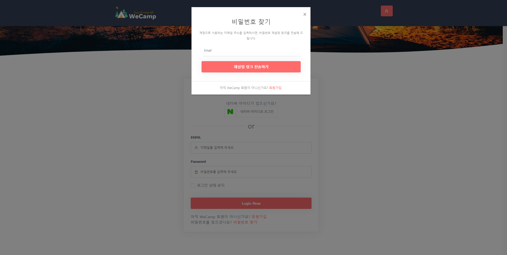
  
 &nbsp;로그인 페이지 하단에 존재하는 비밀번호 찾기를 클릭하면 위에 보이는 이미지와 같이 모달이 생성되는데 가입했던 이메일을 입력한다면 해당 이메일에 임시 비밀번호를 설정 후 메일을 발송한다.
 
  
 메일로 받은 임시 비밀번호로 로그인이 가능하고 후에 개인정보 수정 기능을 통해 비밀번호 재설정이 가능하다.

---

### *Sign-up*

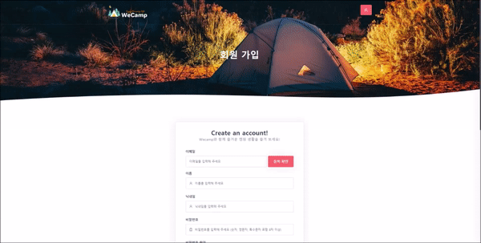
 
&nbsp;회원가입은 대부분 **Javascript**과 **AJAX**를 활용한 비동기 통신으로 이메일을 중복 체크하고 비밀번호 적합성 확인 및 비밀번호 일치 확인 기능을 구현했다.

 
&nbsp;회원가입이 성공하면 위와 같이 회원가입한 이메일로 **인증 메일**이 발송된다. 최종적으로 발송된 메일을 통해서 인증을 완료해야 **정상적인 로그인**이 가능하다.

---

### *Search*

 

 
&nbsp;검색 기능은 **위치를 기준**으로 캠핑장 리스트를 조회 할 수 있다. 날짜는 기본적으로 오늘 날짜부터 다음 날짜까지 설정되어 있고 인원수는 기본값이 1명이다. 검색을 하면 검색된 결과가 **가장 많이 예약된 캠핑장 순**으로 정렬되고 결과 리스트 우측에는 **KakaoMap OpenAPI**를 사용해 검색된 캠핑장들의 위치를 **마커**로 표시된다. 상세 페이지 조회는 이미지를 클릭하거나 지도의 마커를 클릭하면 상세페이지로 접근하도록 설계했다.
 
 
&nbsp;상세 페이지는 최대한 많은 정보를 제공하려고 노력했다.
1. 캠핑장 상세 이미지
2. 캠핑장 소개
3. 캠핑 사이트 종류 및 상세 내용
4. 시설 이용
5. 위치 ( KakaoMap OpenAPI )
6. 날씨 ( OpenWeather OpenAPI )
    
   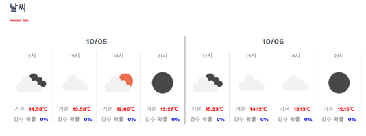
    
   &nbsp;Open Weather에서 제공해주는 시간 별 예보가 3시간 단위로 그 시간에 해당하는 최고/최저 기온을 알려주어 하루 동안의 최고/최저 기온을 구하는 데에 어려움이 있었다. 원래는 일일 예보를 구현하고 싶었으나 유료인 관계로 시간 별 예보로 대체해 기온과 강수 확률을 뽑아내 문제를 해결하였다.
7. 캠핑장 기본 정보
8. 리뷰 리스트
9.  리뷰 평점
10. 주변 관광지( 공공데이터포털 )
    
   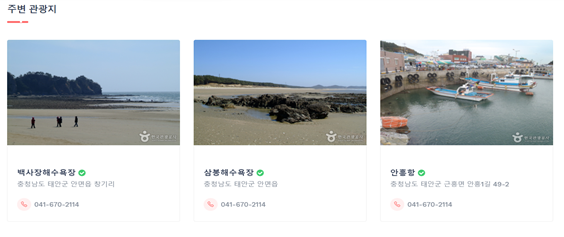
    
   &nbsp;해당 캠핑장의 x, y 좌표를 이용하여 주변 관광지를 구현했다. 해당 관광지를 클릭할 때 상세 정보를 제공해주고 싶었으나 공공데이터포털 API에서 제공해주지 않는 기능이라 NAVER 검색창으로 넘겨주는 것으로 문제를 해결하였다.
    
   
    

&nbsp;예약 페이지로 접근하기 위해서는 캠핑장 사이트 선택과 인원수, 이용 기간을 선택해야한다. 문제는 선택된 이용 기간중 예약 수가 초과되어 **오류**를 발생시키면 안되는데 이러한 문제는 날짜 선택을 할때의 이벤트 함수를 발생시켜 비동기 통신을 통해 **예약 가능 여부**를 서버에 **요청**한다. 그 후 서버에서 해당 기간 동안의 캠핑장 총 예약수와 캠핑장 총 사이트 수를 비교하여 총 예약수가 같거나 더 많다면 **false**로 응답하고 그 반대면 **true**로 **응답**한다. 그리고 서버의 응답 결과에 따라 예약을 진행할 수 있다. 만약 false로 응답을 받는다면 어느 날짜가 현재 예약이 초과되었는지의 정보도 응답 받게된다.

---

### *Booking*

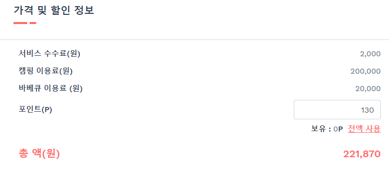
 
&nbsp;예약 페이지에서는 상세페이지로부터 받은 기본 예약 정보를 토대로 예약 상세 정보를 보여주고 여기서 최종적으로 결제요청을 진행 할 수 있다.

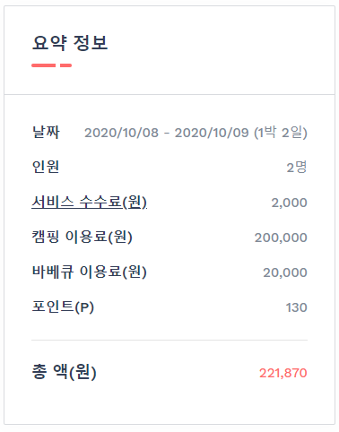
 
&nbsp;우측에는 간단한 예약내용의 요약본을 제공한다.

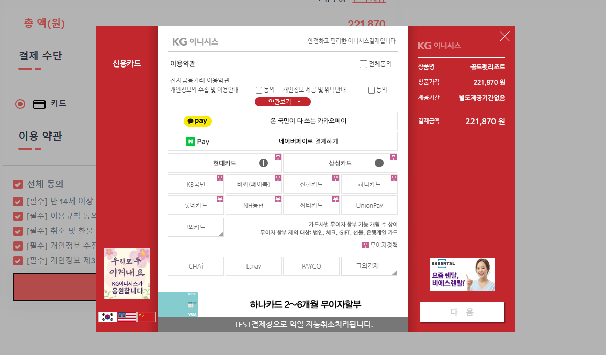
 
&nbsp;마지막으로 동의란을 모두 체크면 결제버튼이 활성화되고 결제버튼을 클릭하면 Import API를 통해 결제 시스템을 구현했다. 결제가 최종적으로 마무리가 되면 DB에 예약 상세 정보와 결제내역이 저장된다. 후의 예약 정보는 마이페이지 서비스를 통해 조회할 수 있다.

---

### *Owner Service*

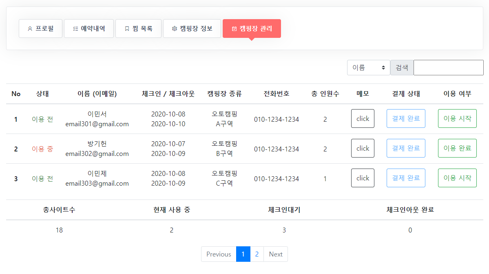
 
&nbsp;**마이페이지**의 캠핑장 관리 탭을 누르면 오늘의 **캠핑장 예약 관리 서비스**를 이용할 수 있다. 캠핑장 관리 탭을 누르게 되면 하단에 예약 리스트가 나오고 현재 몇개의 캠핑장이 사용되고 있는 지 등 간단한 캠핑장 현재 상태 정보를 조회할 수 있다. 각각의 예약자들의 상태는 이용 여부 컬럼의 버튼을 통해 조작이 가능하다.
1. 이용 시작 버튼( 활성화 ) -> 이용 전
2. 이용 완료 버튼( 활성화 ) -> 이용 중
3. 완료 버튼( 비활성화 ) -> 이용 완료

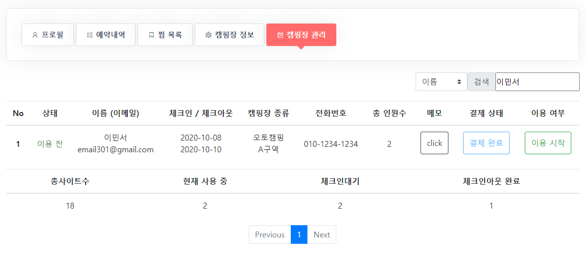
&nbsp;테이블 우측 상단에 검색 입력창을 통해서 **이름** 또는 **전화번호**를 기준으로 정보를 조회할 수 있다.

---

### *My Page*

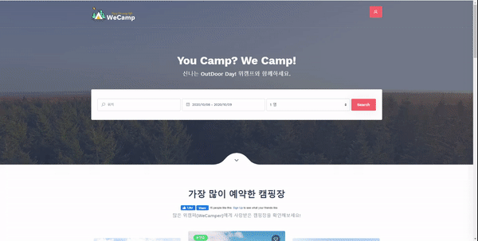
 
&nbsp;마이페이지는 일반 회원과 사업자에 따라 마이페이지 서비스 기능이 제한 되어있다.

  - 일반 회원
  1. 프로필 조회, 수정 및 삭제
  2. 예약 내역 조회
  3. 리뷰 작성
  4. 환불 요청
  5. 찜 목록 조회 및 삭제

  - 사업자
  1. 프로필 조회, 수정 및 삭제
  2. 예약 내역 조회
  3. 리뷰 작성
  4. 환불 요청
  5. 찜 목록 조회 및 삭제
  6. 해당 계정의 캠핑장 정보 조회 및 수정
  7. 해당 보유 캠핑장의 예약 정보 조회 및 상태 변경

---

### *Managing*

&nbsp;관리자 아이디로 로그인 후 관리자 페이지에 접근하게 되면 관리자 관련 기능을 사용할 수 있다.
1. 회원/탈퇴회원 조회 및 삭제
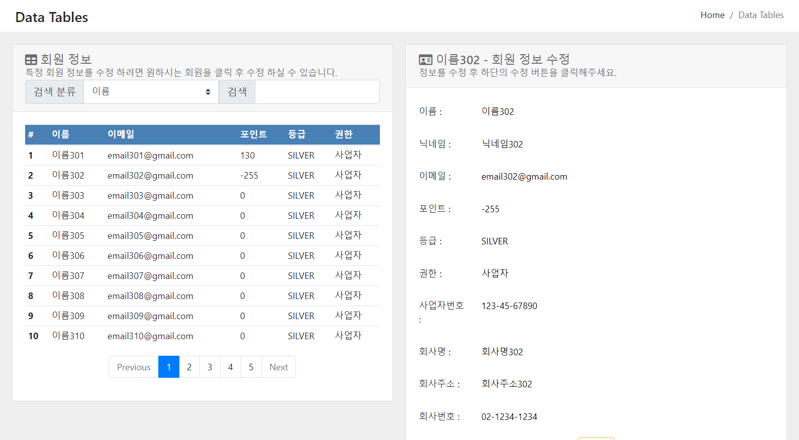

2. 업체 문의 게시글 조회 및 승인/거절 요청
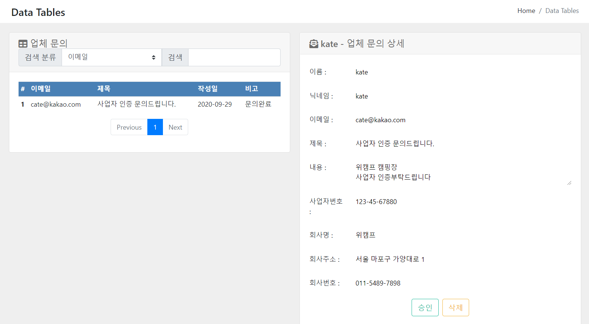

3. 상세 매출 통계 조회
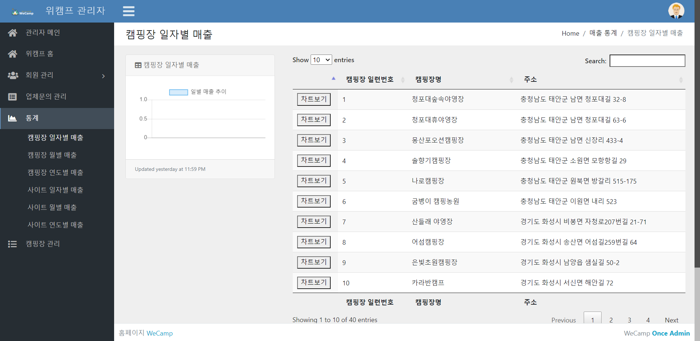
   
4. 캠핑장 조회/삭제/수정
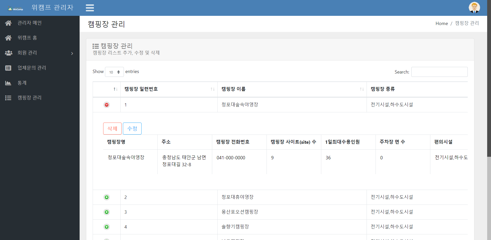

## 2. 아쉬움
 - **문제** : 예약 서비스 오류 😱

    &nbsp;예약 기능을 구현하다 보니 한가지 문제가 발생했다. 만약 사용자가 원하는 예약기간이 실제로 예약이 꽉 차있다면 어떻게 해야할까 라는 의문이 생겼다. 예약은 할 수 있게 기능은 구현했지만 정확한 예약 가능 여부를 구현하지 못했다. 그래서 이러한 불상사를 막기 위해 여러가지 방법을 구상해 봤다.  
    &nbsp;일단 제일 먼저 DB를 분석해 보았다. 다행히 캠핑장 테이블에 총 사이트 수라는 컬럼이 보였다. 처음 DB를 설계 했을 당시 총 사이트 수라는 속성은 그저 정보 저장을 위해 남겨두었었는데 다행이 이것을 통해서 예약 가능 여부를 판별 할 수 있을것 같았다.  
    &nbsp;서버가 사용자측에서 요청한 검색 내용을 토대로 DB에 쿼리를 날려 첫 검색 결과 리스트를 뽑아낸다. 그리고 첫 검색 결과 리스트를 이중 for문을 사용해서 사용자가 원하는 예약 기간 동안에 총 사이트 수가 해당 날짜의 전체 예약 수보다 큰 지 판별하여 만약 총 사이트 수 가 전체 예약 수보다 작다면 그 캠핑장을 다른 리스트 객체에 담아두었다. 그리고 나서 다시 한 번 더 다른 리스트 객체에 담아두었던 캠핑장을 뺀 나머지를 검색하도록 쿼리를 날리고 그 결과를 최종적으로 사용자측에 응답하였다.  
    ***< 개선방안 >*** 
    &nbsp;최대한 서버측에서 예약 가능 여부를 판별하고 사용자측에 응답하려 했지만 아직까지 완벽하게 해결되지 않았다. 그 이유는 캠핑장 사이트가 현재 개별적으로 예약 가능 여부 판단이 불가능해서, 서버에서 캠핑장 예약이 가능하다고 판단했지만 실제 서비스에서는 사용자가 원했던 사이트가 이미 다 차있어 예약 오류가 발생할 수 있다. 이것을 해결할 방법은 캠핑장 종류 테이블에 사이트 수의 속성을 추가한다면 금방 해결될 것이다.   

- **문제** : 서버 트래픽 포화 😨
    
    &nbsp;만약 다량의 데이터를 처리해야한다면 어떨까? 사실 이번 프로젝트에서 프로그램 성능이나 속도를 크게 신경쓰질 않았다. 그래서 그런지 다량의 캠핑장을 처리해야할 때 분명 속도차이가 느껴질 거라 예상된다. 현재 검색 기능만 보아도 서버에서 처리해줘야 할게 많다. 예를 들어서 첫 쿼리의 결과가 100개라고 하고 6일간의 예약 가능 여부를 판별해야 한다고 한다면 이중 for문으로 각 캠핑장별로 6일 동안의 예약수를 비교해야 하니 1*6을 100번 반복하면 거의 총 600번의 쿼리를 날려야한다. 아무리 컴퓨터의 성능이 좋아졌다한들 이정도면 분명 느려진 속도를 체감 할 수 있을 것 같다.  

    ***< 개선방안 >*** 
    &nbsp;사실 이러한 대용량 데이터들을 처리하는 방식을 안해봐서 그런지 엄청난 해안법이 생각나질 않는다. 조금이라도 더 서버측의 트래픽을 줄이기 위해선 앞쪽, Front단에서 최대한 해결해주는 것도 하나의 방법이라 생각한다. 또한 대량 데이터의 저장과 검색을 더 효율적으로 하기 위해서 NoSQL를 사용하는 것도 또 하나의 방안인것 같다. 하지만 이미 만들어진 프로그램의 시스템을 바꾼다는 것은 그리 쉽게 결정할 일이 아니라고 생각되기 때문에 미리 프로그래밍을 하기 전에 확실히 경험과 자료를 통해서 시스템 설계를 잘 짜놔야 하겠다. 